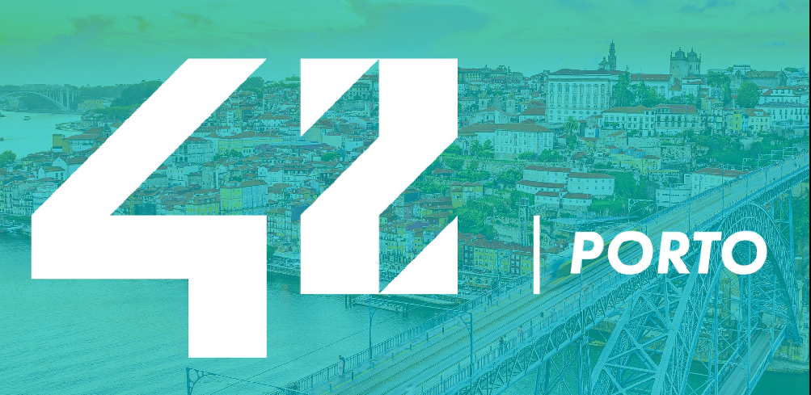

At 42, there are no teachers or books. Learning takes place collaboratively, and completing projects allows you to earn points and pass levels – as if you were playing a game. After learning the basics, each student is free to design their path by selecting projects from the areas that interest them the most.

<h2> 💻 Projects </h2>

<h2> Rank 00 </h2>

<a href="https://github.com/victtorm/Libft">

<h2> Rank 01 </h2>

<a href="https://github.com/victtorm/get_next_line"> <a href="https://github.com/victtorm/ft_printf">

<h2> Rank 02 </h2>

<a href="https://github.com/victtorm/push_swap"> <a href="https://github.com/victtorm/pipex"> <a href="https://github.com/victtorm/fract_ol">

